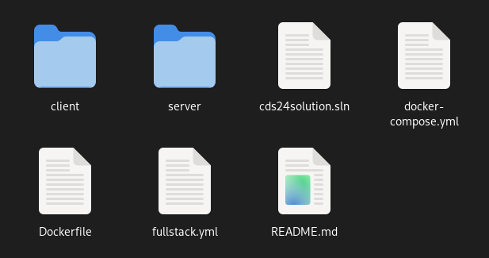
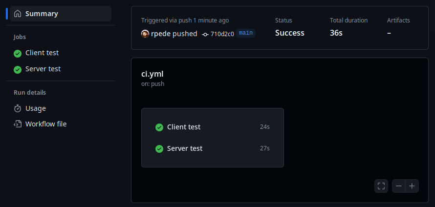
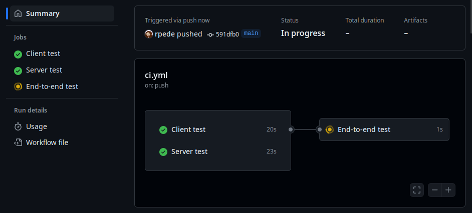
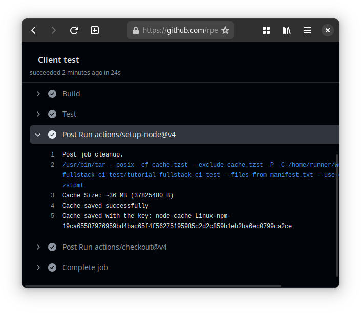
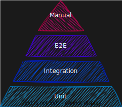

# Fullstack CI tutorial

This tutorial will let you build Continuous Integration (CI) workflow for a
fullstack web application.
The application consist of a React frontend and a ASP.NET Core backend.

The tutorial is aimed at teaching how to use parallel jobs in a GitHub Actions
workflow and creating dependencies between jobs.

In this tutorial you will:

- Create a job to run tests for React
- Create a job to run tests for .NET
- Create a job that runs end-to-end (E2E) tests after the other jobs
- Speed up the workflow with caching

The tutorial won't cover how to write tests.

Prerequisites:

- [React CI Tutorial](https://github.com/rpede/tutorial-react-ci)

## Getting started

1. Click on the green "Use this template" button at the top
2. Then select "Create a new repository"


3. Click "Create repository from template"
4. Type a repository name and click "Create Repository"
5. Make a local clone the repository following the instructions [here](https://docs.github.com/en/repositories/creating-and-managing-repositories/cloning-a-repository)
6. Open your local clone in WebStorm, Rider or another editor

# Initial workflow

Create a new file `.github/workflows/ci.yml` with the following skeleton:

```yml
name: Continuous integration
on:
  push:
    branches: ["main"]
  pull_request:
    types: [opened, synchronize, reopened, closed]
    branches: ["main"]
jobs:
  client_test_job:
    name: Client test
    runs-on: ubuntu-latest
    steps:
      - uses: actions/checkout@v4

  server_test_job:
    name: Server test
    runs-on: ubuntu-latest
    steps:
      - uses: actions/checkout@v4
```

It defines a workflow with 2 jobs running in parallel.
The jobs don't do anything interesting yet.
The only thing they do is checkout the code from the repository.

# Test client (aka frontend)

In this section we will modify `client_test_job` to execute test for the
client/frontend.

First we have to talk a bit about how the files in the repository is
structured.

```
├── client
│   ├── dist
│   ├── e2e
│   ├── package.json
│   ├── package-lock.json
│   ├── playwright-report
│   ├── public
│   ├── src
│   └── test-results
└── server
    ├── Api
    ├── DataAccess
    ├── Service
    └── UnitTests
```

Everything related to React is located in `client/` and everything related to
.NET in `server/`.
Notice that `package.json` is located within `client/` folder.

The reason that understanding the folder structure is important, is because most
`npm` commands operate on `package.json`, either by using the information found
within or by modifying it.
So we need to tell `npm` where to find `package.json`.

The steps after `actions/checkout` will run from the root of the repository
(the location shown in the screenshot).
Unless you tell it to do something else.



We can get **npm** to use a different folder as its working directory with the
`--prefix` parameter.
So, we can make it run as if the current folder is `client/` folder by adding
`--prefix=client` to any `npm` command.

Enough talk about folders.
Just append the following to your `ci.yml` skeleton, right after checkout under
`client_test_job`:

```yml
- uses: actions/setup-node@v4
  with:
    node-version: "22"
- name: Install dependencies
  run: npm clean-install --prefix=client
- name: Build
  run: npm run build --prefix=client
- name: Test
  run: npm run test --prefix=client
```

_Make sure it is indented correctly._

Notice that this is very similar to the [React CI
Tutorial](https://github.com/rpede/tutorial-react-ci/blob/main/README.md).

## Test server (backend)

In this section we will modify `server_test_job` to execute test for the
server/backend.

The overall process is very similar to how we do it for the client/frontend,
though the actual commands differ.

The `dotnet` command also operates on files from the point of view of the
current working directory.


Some sub-commands of `dotnet` operates on the solution (`*.sln`) file.
While others operate on a project (`*.csproj`) file.

To read more about the `dotnet` sub-commands, check out [.NET CLI
overview](https://learn.microsoft.com/en-us/dotnet/core/tools/).

In this repository you will find the solution at the root level.
Which is convenient since it means that we don't have to append any extra
parameters to the commands.

To build a .NET solution, we use `dotnet build`
We use `dotnet test` to (drum roll) run tests.

There are a pre-made action that we can use to set up a specific version of
.NET, just like there is for Node.js.

Combined it becomes:

```yml
- uses: actions/setup-dotnet@v4
  with:
    dotnet-version: "8.0.x"
- name: Build
  run: dotnet build
- name: Test
  run: dotnet test
```

Append the snippet to `server_test_job` in `.github/workflows/ci.yml`.

_Make sure it is indented correctly._

Semantic versioning is used to specify a version of .NET.
With `dotnet-version: "8.0.x"` we specify that we want the latest patch-release
of .NET version 8.0.

## See it in "Action"

Before pushing the workflow to GitHub, I think we should add a timeout to each
job.
A timeout is the max amount of time a job can run before it gets cancelled.

I think it is generally a good idea to set a timeout for each job, just in case
it goes rouge and never stops.
The reason is that your have a limited amount of minutes each month depending
on your billing plan.
You likely don't have to worry too much about it though.
Since there is a decent amount of minutes already included even on the free
plan.
It is just nice to know, that we can set an automatic break in case something
goes wrong.

To set a timeout you should add the following, just above the `steps` in each
of the jobs:

```yml
timeout-minutes: 15
```

_Make sure it is indented correctly._

Full [ci.yml](https://gist.github.com/rpede/159739db372665b2dd4709a5d5517a15)
for reference.

Stage, review, commit and push your changes.

```sh
git add .github
git diff --cached
# review you changes
git commit -m 'Build and test jobs for client and server'
git push
```

Check the "Actions" tab on the GitHub page for your repository.



## End-to-end (E2E) test

Now that we have tested both the client and server.
We should test that they work together, making sure the entire application stack
behaves as expected.

This tutorial won't go into details on how to write E2E tests.
Since the goal is just to show how to use jobs in a GitHub Actions workflow.

The brief version of how this works, is that we spin up the entire stack
(frontend, server and database).
Then a tool named [Playwright](https://playwright.dev/) is used to control a
web browser interacting with the application.
This browser interaction is scripted using a high-level API in JavaScript or
TypeScript.

In the `.github/workflows/ci.yml` file append following to the end:

```yml
e2e_test_job:
  name: End-to-end test
  runs-on: ubuntu-latest
  needs: [client_test_job, server_test_job]
  timeout-minutes: 15
  steps:
    - uses: actions/checkout@v4
    - uses: actions/setup-node@v4
      with:
        node-version: "22"
    - uses: docker/setup-buildx-action@v3
    - name: Start services
      run: docker compose up -d --wait
    - name: Install dependencies
      run: npm clean-install --prefix=client
    - name: Install browsers
      run: npx --prefix=client playwright install --with-deps
    - name: Run e2e tests
      run: npm run e2e --prefix=client
    - name: Stop services
      run: docker compose down
```

_Check the level of indentation_

That was a huge chunk.
Let's break it down piece by piece.

What you appended is just another job definition, like `client_test_job` and
`server_test_job`.

The first new thing in this job is the `needs: [client_test_job,
server_test_job]` part.
It makes execution of the job depend on the two other jobs to have successfully
been completed.

Whether you actually want to postpone your E2E-test to after all unit-tests
have completed is somewhat situational.
If your unit-tests covers almost all code and are very likely to catch any
potential bugs, then it can be a good idea to postpone E2E-tests to after they
have completed.
However, if your E2E-tests are just as likely to catch bugs compared to your
unit-tests, then you might want to run everything in parallel.

In general, you probably want to try and keep you minutes count for executing
your workflow low.
Each job gets executed on its own runner.
It is the combined execution time for all runners that counts towards your
spending.
Also, it is slightly more eco-friendly not having computers waste unnecessary
energy.

Next, we have:

```yml
- uses: docker/setup-buildx-action@v3
```

The `setup-buildx-action` makes docker available.
It is called something with build, because it is intended to provide an
environment for us to build Docker images.
We are going to use it to spin up a database for the tests instead.
An alternative way to start a database in a container for testing is with
something called [Testcontainers](https://testcontainers.com/).

Then we have:

```yml
- name: Start services
  run: docker compose up -d --wait
```

Start the services our application needs in Docker containers.
More on what Docker containers are and the `docker compose` command in a
different tutorial.

Next:

```yml
- name: Install dependencies
  run: npm clean-install --prefix=client
```

Predictably installs dependencies of exact versions from `package-lock.json`
found in the `client/` folder.

Next:

```yml
- name: Install browsers
  run: npx --prefix=client playwright install --with-deps
```

This is a perfect example on how we can name steps to make the workflow easier
to understand.
Playwright depends on various web browsers being installed, such that it can
use them to execute tests.
The command above simply installs those browsers.

Final:

```yml
- name: Run e2e tests
  run: npm run e2e --prefix=client
```

It simply runs the E2E tests.
Well, actually `e2e` is an alias for a different command found under the
`scripts` section in `client/package.json`.
The actual command that will be run with `e2e` alias is `npx playwright test
--project chromium`.
It simply means "execute playwright tests using chromium as the web browser".
[Chromium](https://www.chromium.org/Home/) is the open source base which Google
Chrome is build from.
It should ensure that the web application works in Chrome.
Btw, Microsoft Edge, Opera and Vivaldi is also built from Chromium.

It is also possible run tests with `firefox` and `webkit` (which is what Safari
is build upon).

Checkout [Comparison of browser
engines](https://en.wikipedia.org/wiki/Comparison_of_browser_engines) for an
overview.
It basically boils down to everything except Gecko (engine in Firefox) being a
fork of [KHTML](https://en.wikipedia.org/wiki/KHTML).
Anyway, that is just a fun little piece of history and not really too important
as long as our application just works in most browsers.

At the end, we shutdown the containers with:

```yml
- name: Stop services
  run: docker compose down
```

Enough rambling for now.

Commit and push your work!
See if you can come up with a descriptive commit message for your changes.
Then navigate to "Actions" tab on GitHub page for your repository and observe
the visual representation of the jobs in your workflow.



## Optimize with dependency caching

Each job will run in an ephemeral environment that gets discarded afterward.
It means that each time a job is run it gets a fresh environment.
This is great for reproducibility, since nothing from previous run will affect
the execution of the next job.
However, it also means that a job needs to configure its environment each time.
With configure, I mean run things like `actions/checkout`,
`actions/setup-node`, `npm clean-install` etc.
It all takes time.
Especially `npm clean-install` can take some time as it downloads all
dependencies, including dependencies of the dependencies.

When you run `npm clean-install` on your own machine, it will check your global
cache for the exact package before it attempts to download it.
The cache is stored in `_cacache` sub-folder of the path that is outputted when
you run `npm config get cache`.

On GitHub however, the cache for **npm** is empty each time a job in your
workflow starts, because it gets a fresh environment.
It means that it has to download everything from scratch each time.
GitHub Actions have its own general purpose cache that can be used to speed up
the download.

The way GitHub Actions cache works, is that it compress and uploads files from
one or more paths to a storage location shared between jobs.
This happens at the end of job execution.
The compressed files are stored under a cache-key.
Next time the job runs, it will attempt to fetch and extract the files stored
under the cache-key.
You can think of it as a giant persisting hash-map that is shared between jobs.
A checksum of the file specifying the dependencies is often used as cache-key.
That way, having different dependencies will make it use a different cache-key.
See [Caching dependencies to speed up
workflows](https://docs.github.com/en/actions/writing-workflows/choosing-what-your-workflow-does/caching-dependencies-to-speed-up-workflows)
for more information.

A different way to store files between jobs is as artifacts.
See [Storing workflow data as
artifacts](https://docs.github.com/en/actions/writing-workflows/choosing-what-your-workflow-does/storing-workflow-data-as-artifacts).
You should at least read the section comparing artifacts to caching.

Using caching to speed up `npm clean-install` in your workflow is pretty easy.
All you need to do is to replace:

```yml
- uses: actions/setup-node@v4
  with:
    node-version: "22"
```

With:

```yml
- uses: actions/setup-node@v4
  with:
    node-version: "22"
    cache: "npm"
    cache-dependency-path: client/package-lock.json
```

Commit and push your changes.

Go to "Actions" tab on GitHub page for your repository.
Then spot the lines that have to do with caching in the workflow run logs.
There should be some lines about it both in the beginning and the end of the
job log.



## Challenge

See if you can figure out how to use the caching trick with `dotnet` by looking
at the documentation for
[setup-dotnet](https://github.com/actions/setup-dotnet).

_Hint: your need to add an option to `PropertyGroup` of your `*.csproj` files._

You might also have noticed that "Install browsers" job takes a long time.
Inspecting the log, it seems like it uses `/home/runner/.cache/ms-playwright`
for local download cache.
See if you can find out how to persist the cache using [Cache
action](https://github.com/actions/cache).

## Closing thoughts

The workflow you've built here isn't meant to be a one-size fits all for
testing, since the nuances of testing strategies will differ between
organizations and projects.

In broad terms, a solid testing strategy will look like this:



Also, as seen in the [React CI
Tutorial](https://github.com/rpede/tutorial-react-ci), it would be really nice
to make test-reports available on pull-requests.
Reports have been omitted in this tutorial.
For a real world project you would also want to generate and present
test-reports.

[Here](https://gist.github.com/rpede/af58c981aee6a21045c6c799cbd2ca59) is the
entire workflow file for reference.
